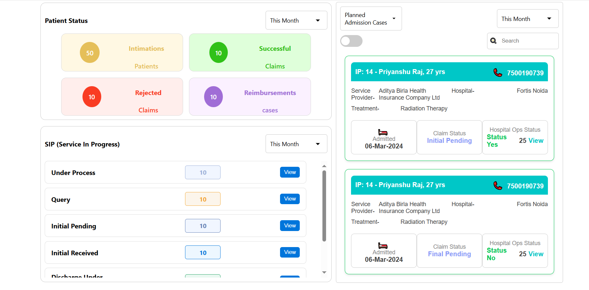

# Project Containing the JWT auth with Dashboard and SignUp functionality
### Sign Up Page Image-----------
### Dashboard Image--------- 

# Setup for running the completed project the mention in the sub folder frontend and backend
### for frontend we need to add a .env file
### REACT_APP_URL = "URL of the backend for eg. http://localhost:5000"
### For SignUp you have to register the user by hitting the following route    Your URL/api/auth/registe
### Example of body for signup 
  ### {
  ### "username": "testuser",
  ### "password": "password123",
  ### "number":"123456789"
   ### }
### After that you can login through frontend by same credentials

## for backend folder all the complete instruction are provided in the folder

### Prospect of improvement Integration of Signup page functionality, Database integration, Dynaminc Data integration
### further optimisation in the code

    